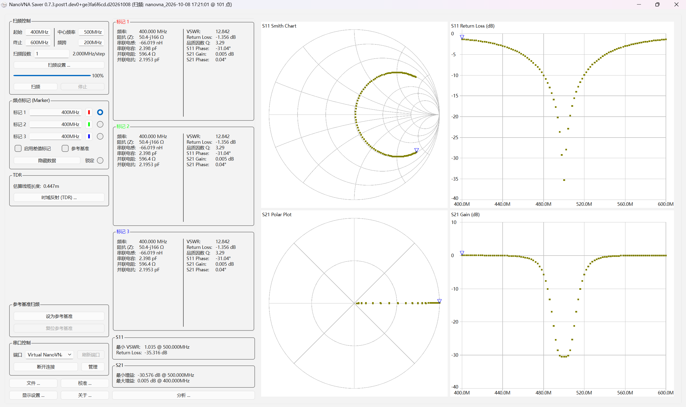
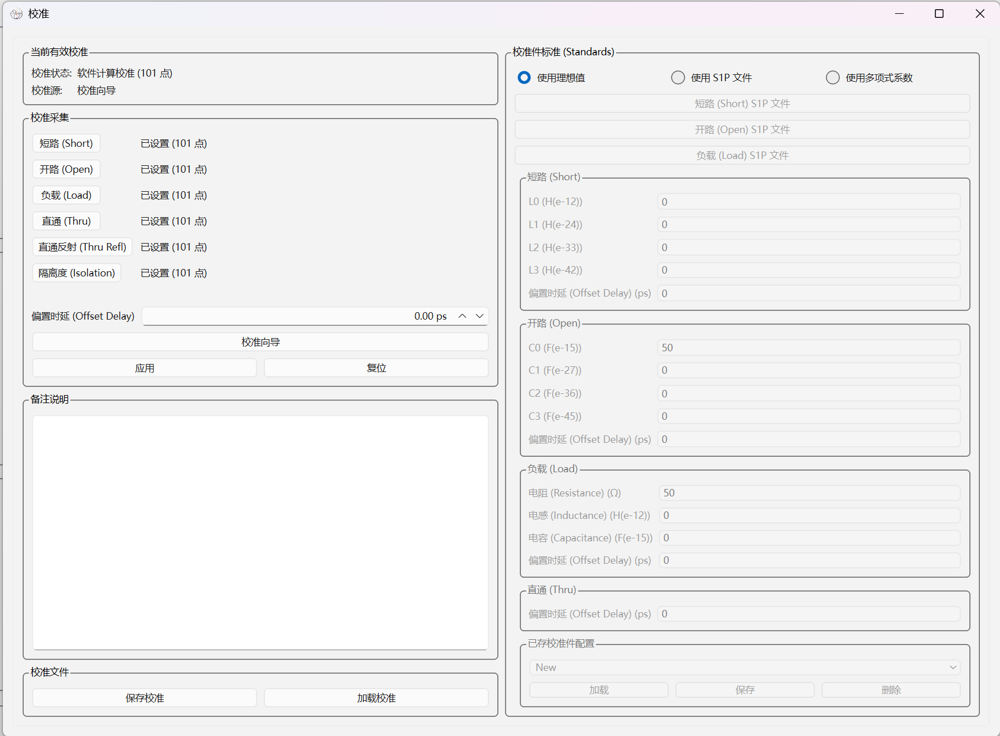

# NanoVNA-Saver 简体中文版

一款支持多平台的 NanoVNA 矢量网络分析仪上位机软件。支持读取与导出 Touchstone 文件、多段合并扫频（突破 101 点硬件限制）、数据图表显示与深度分析。

本项目基于开源上位机 [NanoVNA-Saver](https://github.com/NanoVNA-Saver/nanovna-saver) 进行简体中文本地化与稳定性优化，并提供 Windows 开箱即用的免安装独立程序。

---

## 📸 软件界面预览

### 主界面


### 校准窗口（SOLT 系统误差校准）


---

## 🚀 快速上手

### 方式 1：Windows 单文件免安装版（推荐）
直接在 GitHub 的 **[Releases 页面](https://github.com/qworkhard/NanoVNA-Saver-Chinese/releases)** 下载最新构建的程序：
* **`NanoVNASaver-ZH.exe`**
* 下载后双击即可直接运行，无需配置 Python 环境。

### 方式 2：从源码运行
1. 克隆本仓库：
   ```bash
   git clone https://github.com/qworkhard/NanoVNA-Saver-Chinese.git
   cd NanoVNA-Saver-Chinese
   ```
2. 创建并激活虚拟环境：
   ```powershell
   python -m venv .venv
   .\.venv\Scripts\activate
   ```
3. 安装依赖并启动：
   ```powershell
   pip install -e .
   python run.py
   ```

---

## ✨ 核心功能特性

* **硬件兼容性广**：支持 NanoVNA, NanoVNA-H, NanoVNA-H4, NanoVNA-F, LiteVNA, AVNA (Teensy) 以及 TinySA 频谱仪；
* **分段多点数扫频**：通过分段拼接突破下位机单次 101 点限制，可实现成千上万点的超高频率分辨率测量；
* **丰富图表显示**：支持 S11 和 S21 的史密斯圆图（Smith Chart）、对数幅度（LogMag）、相位（Phase）、极坐标（Polar）及电压驻波比（VSWR）等多种视图；
* **多功能频点标记**：实时读取标记点处的频率、复阻抗（R+jX）、等效串并联 L/C、Q 值、回波损耗等，支持差值标记（Delta Marker）；
* **完整系统误差校准**：内置 SOLT（短路/开路/负载/直通）向导式校准，支持校准参数保存、加载及非理想校准件多项式补偿；
* **TDR 时域反射测量**：一键估算射频同轴线缆物理长度与特性阻抗；
* **滤波器智能分析**：一键计算低通、高通、带通、带阻滤波器的截止频率、通带带宽、Q 值与插入损耗；
* **参考基准对比**：支持将当前扫描曲线固定为参考背景（Memory Trace），便于调谐时进行同屏即时对比；
* **标准文件导入导出**：支持 1 端口与 2 端口 Touchstone（`.s1p` / `.s2p`）标准仿真文件导出与加载，支持图表高分辨率图片导出。

---

## 🔧 本版本主要优化与调整

1. **界面与术语完整汉化**：
   * 遵循射频工程标准术语（短路 Short、开路 Open、负载 Load、直通 Thru 等），保留国际通用的符号与缩写（`S11`, `S21`, `VSWR`, `Return Loss`, `Smith Chart` 等）。
2. **排版挤压修复**：
   * 调整了标记卡片（Marker）的布局逻辑与最大宽度，避免在中文字符下标签与数值发生重叠遮挡。
3. **连续扫频防卡死与稳定性加固**：
   * 优化了“连续扫频 (Continuous Sweep)”循环中的线程调度与 CPU 让步机制，彻底解决了连续扫频时主界面容易无响应、按键点不动、“停止”按钮失灵的并发问题。
4. **内置虚拟演示设备 (Virtual NanoVNA)**：
   * 未插入物理硬件时，可在端口下拉框直接选择虚拟演示设备，随时体验扫频操作、图表交互与校准向导全流程。

---

## 📖 常用操作指南

### 1. 设备连接
将 NanoVNA 用 USB 线接入电脑，点击【串口控制】中的【刷新端口】，在端口下拉框选中您的设备，点击【连接设备】。若未连接硬件，可选择【Virtual NanoVNA (仿真)】体验。

### 2. 扫频参数设置
* **起始与终止频率**：直接输入数值即可，支持带单位如 `433M`、`2.4G`、`100k` 或科学计数法如 `4.33e8`；
* **扫频段数 (Segments)**：每段对应硬件单次测量的 101 点。例如输入 `3` 段，软件将连续扫描拼接出 301 个频点，大幅提高测量精细度。

### 3. 标记（Marker）使用
* 点击左侧【频点标记】面板中的单选框可切换当前鼠标操控的标记；
* 按住键盘 **Shift 键**并用鼠标点击图表，可直接将距离最近的标记拖动到指定位置。

### 4. 系统校准流程
1. 点击主界面下方的【校准 ...】按钮打开校准窗口；
2. 推荐点击【校准向导】，根据界面弹窗提示依次拧上短路 (Short)、开路 (Open)、负载 (Load) 和直通 (Thru) 接头并点击确定；
3. 向导完成后自动生成并应用 12 项误差校准矩阵；
4. 点击【保存校准】可将当前校准数据保存为文件，下次直接【加载校准】复用。

---

## 🛠️ 打包构建

若在本地修改了源码，可在激活虚拟环境后使用 PyInstaller 构建单文件可执行程序：
```powershell
pip install pyinstaller
pyinstaller NanoVNASaver-ZH.spec
```
构建生成的文件位于 `dist/NanoVNASaver-ZH.exe`。

---

## 📜 开源协议与致谢

* 本项目基于 [NanoVNA-Saver](https://github.com/NanoVNA-Saver/nanovna-saver) 进行二次开发，遵循 **GNU General Public License v3.0 (GPL-3.0)** 开源协议。
* 原作者及贡献者版权声明：
  * Copyright (C) 2019, 2020 Rune B. Broberg
  * Copyright (C) 2020-2024 NanoVNA-Saver Authors
